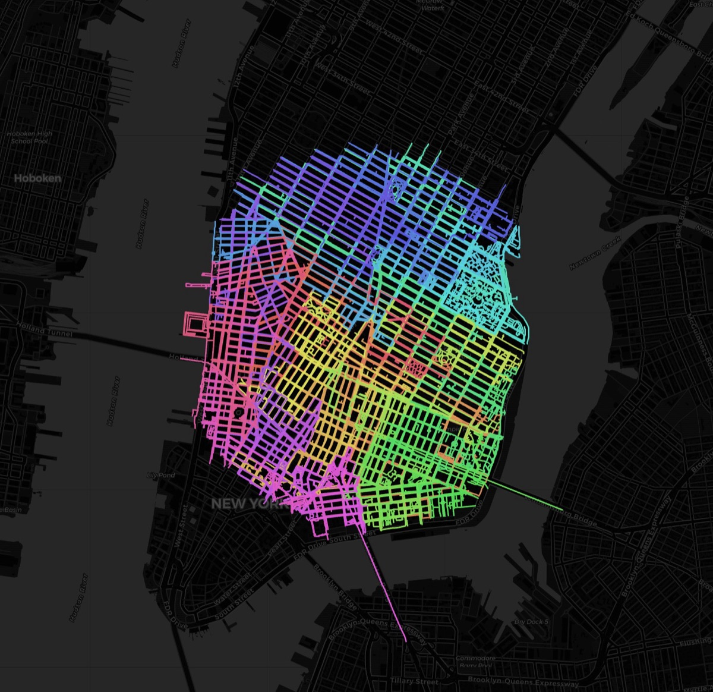

# STR1DE — client-side street coverage planner

[](https://github.com/slink/stride/actions/workflows/ci.yml)

Generates running routes that cover every street in an area, each under a
chosen length, minimizing repeats — **entirely in the browser**. No backend.

### ▶ [Try it live — slink.github.io/stride](https://slink.github.io/stride/)



*Cooper Square, Manhattan — 1.2 mi radius, 5 mi max run. **102 runs, 502.2 miles
run to cover 440.2 street miles** (+14.1% repeat overhead), solved in about 2 s
in the browser. Each color is one run.*

## Export to your watch

Every run downloads as GPX, and "Download all GPX" grabs the set. This is actual
output from the plan above — run 1, 4.97 mi, 350 track points:

```xml
<?xml version="1.0" encoding="UTF-8"?>
<gpx version="1.1" creator="STR1DE" xmlns="http://www.topografix.com/GPX/1/1">
  <trk><name>STR1DE Run 1</name><trkseg>
      <trkpt lat="40.7279594" lon="-73.9913474"></trkpt>
      <trkpt lat="40.728498" lon="-73.991198"></trkpt>
      <trkpt lat="40.7286131" lon="-73.9912244"></trkpt>
      <!-- … 347 more … -->
  </trkseg></trk>
</gpx>
```

Tick **Include elevation** and each `<trkpt>` also carries `<ele>`. Drop the file
on a Garmin/Coros/Suunto watch, or import it into Strava.

## Run it

The hosted copy is at **[slink.github.io/stride](https://slink.github.io/stride/)**.
To run it yourself: it's static files, but it needs a server because the app uses
a Web Worker and `fetch`:

```bash
python3 -m http.server 8000
```

Open http://localhost:8000, type an address, pick max run length and radius, hit
**Plan my runs**. **Demo mode** runs a precomputed sample with no network at all.

**Route quality** trades solve time for shorter routes: Fast (the default) solves
the plan above in ~1.5 s at 14.8% overhead, Best takes ~2.3 s and reaches 14.1%.
Fast captures most of the win because matching quality saturates almost
immediately in the number of candidates considered.

## How it works (all client-side)

1. **Geocode** address → lat/lon via Nominatim (once, on submit).
2. **Fetch streets** within the radius via the Overpass API.
3. **Build graph** and **solve** in a **Web Worker** so the UI never freezes.
   Mid-block degree-2 shape points are contracted into super-edges first
   (typically ~10x fewer nodes on real OSM data), so the matching Dijkstras run
   on intersections only; GPX still traces the full street geometry.
4. **Render** on Leaflet, **export** GPX per run.

## Public OSM infrastructure

STR1DE runs on **volunteer-funded services** — Nominatim for geocoding, Overpass
for street data, CARTO for tiles, Open-Elevation for climb. Nobody is paid to
serve your queries, so the app is built to stay inside the published policies:

| Their rule | What STR1DE does |
|---|---|
| Nominatim: *"an absolute maximum of 1 request per second"* | One geocode per explicit submit, then cached |
| Nominatim: *"Auto-complete search … you must not implement such a service on the client side"* | No keystroke handler on the address field — geocoding fires only on submit |
| Nominatim: *"Results must be cached on your side"* | Geocode results cached in `localStorage` |
| Nominatim / OSM: *"Clearly display attribution as suitable for your medium"* | Credit in the sidebar and on the map |
| Overpass: *"a maximum of about 10000 requests per day … below about 1 GB per day"* | Responses cached 7 days; 60 s cooldown between network fetches |

**Caching.** A default query (1.2 mi, walk) returns about 4 MB of JSON, and
`localStorage` holds roughly 5 MB per origin as UTF-16. So responses are reduced
to the fields the graph builder actually reads — node coordinates and way
node-refs — and delta-coded as integers at OSM's native 1e7 precision. That area
becomes **0.94 MB, losslessly**: the graph rebuilt from cache has an identical
node count, edge count, and total length. Entries evict least-recently-used when
the quota is hit, and an area too large to cache simply isn't cached rather than
breaking the plan.

**Rate limiting.** After a network fetch the plan button is disabled for 60 s
with a countdown, stamped into `localStorage` so reloading the page can't reset
it. Replanning an already-cached area is exempt and stays instant.

**Asking for less.** The query uses `out skel`, not `out body`. The graph builder
reads only `id`/`lat`/`lon`/`nodes`, and highway filtering already happens
server-side, so every tag byte was downloaded and discarded — 7.3 MB → 4.1 MB
raw (0.81 → 0.57 MB gzipped) and half the JSON to parse, for a byte-identical
plan.

**Failure.** Public instances refuse work under load, and the same query can take
2.5 s or 18 s minutes apart. Mirrors are tried *sequentially* after a failure,
never raced — racing would double the load on volunteer infrastructure to save
one user a few seconds. An HTTP 200 isn't trusted on its own either: some
instances serve a regional extract and answer out-of-area queries with an empty
result, so an empty response falls through to the next endpoint instead of
surfacing as "no streets found here".

**Identification.** A browser *cannot* set `User-Agent` — it's a forbidden header
name, and a custom header would force a CORS preflight, doubling the request
count. Nominatim's policy accepts the alternative: *"a valid HTTP Referer **or**
User-Agent identifying the application"*, and the browser sends `Referer`
automatically.

**If you fork this and expect real traffic, run your own Overpass instance and
use a paid geocoder.** The public endpoints are a courtesy, not a backend.

## Files

The app is the five files at the root — that's what GitHub Pages serves:

- `index.html` — UI.
- `coverage_core.js` — the solver: graph, degree-2 contraction, odd-node
  matching, Euler circuit, clustering, GPX. Runs in the browser and in Node.
- `net_cache.js` — response cache, slim/delta encoding, cooldown arithmetic.
- `worker.js` — Web Worker: Overpass JSON → graph → plan.
- `demo.json` — offline sample.

Everything else is supporting material:

- `test/` — assertion-based suites that exit non-zero on failure.
  `bun test/all.js` runs them all.
- `tools/` — `attribution.js` and `measure_partition.js`, diagnostics behind the
  overhead and zoning decisions; not part of the app.
- `docs/` — README assets.

## Development

Tests run on `bun` (or `node`): `bun test/all.js`. CI runs the suite under both
runtimes on every push, so the "or `node`" is checked rather than assumed. A
pre-commit hook applies the same lint locally and runs the suite. Enable it once
per clone:

```bash
git config core.hooksPath .githooks
```

## Verified

- Coverage is **complete** — every street appears in the plan, pinned by tests on
  both clean and holed grids. Every edge is assigned to exactly one zone and all
  components within it are solved, so nothing is dropped at a zone seam.
- Every run respects the max-length cap, with one unavoidable exception: a single
  street longer than the cap becomes its own over-cap run, since edges are atomic
  and can't be split mid-street. Pinned by a test.
- The first run begins at the intersection nearest the address.
- Matches the Python reference on clean grids (11 runs / +5% identical).
- The cache round-trip is lossless on real OSM data — same nodes, same edges,
  same total length to the last digit.

## Honest limits

- **Heuristic, not optimal.** Odd-node matching is sorted-greedy over each node's
  k nearest candidates plus a 2-opt pass (k=2 on Fast, 12 on Best), not optimal
  Blossom. Measured against exact optima computed by subset DP on sampled real
  sub-instances, it lands within 0.3% of optimal at n=8 and 1.9% at n=20. The gap
  grows with instance size and a real odd set is ~5,000 nodes, so the true figure
  there is larger — extrapolating that far from small samples isn't a claim worth
  making.
- **Blossom isn't built here, deliberately.** A nearest-neighbour lower bound puts
  the shipped matching 1.93x above it, which looks like large headroom. It isn't:
  on the same geometry the true optimum sits ~1.70x above that bound too, so most
  of the apparent gap is slack in the bound rather than reachable improvement.
- **Real-city overhead is ~14–27% on irregular areas.** Covering every street
  honestly requires deadhead between odd junctions, so "miles run" exceeds "street
  miles" by this much — expected, not a bug. Sparse networks are worse
  (Brattleboro VT measures 45%) because dead-end streets must be run twice.
  Optional `cluster:true` zoning adds ~5–7% on top for grouped runs; it costs
  overhead without improving compactness, so it's off by default.
- **Big radii mean big payloads.** The plan above is ~4 MB of OSM JSON. The
  download dominates the wait, not the solve.
- **Elevation is off by default and best-effort.** It POSTs every node to the
  public Open-Elevation API in batches — slow on big areas, and that instance is
  rate-limited and sometimes down. On any failure the plan still completes with
  climb shown as "–" (null, never a fabricated 0). The worker accepts an
  `elevationUrl` override for a self-hosted endpoint.
- **The cooldown is per-browser, not global.** It stops one tab from hammering
  Overpass; it cannot stop a hundred forks from doing so.
