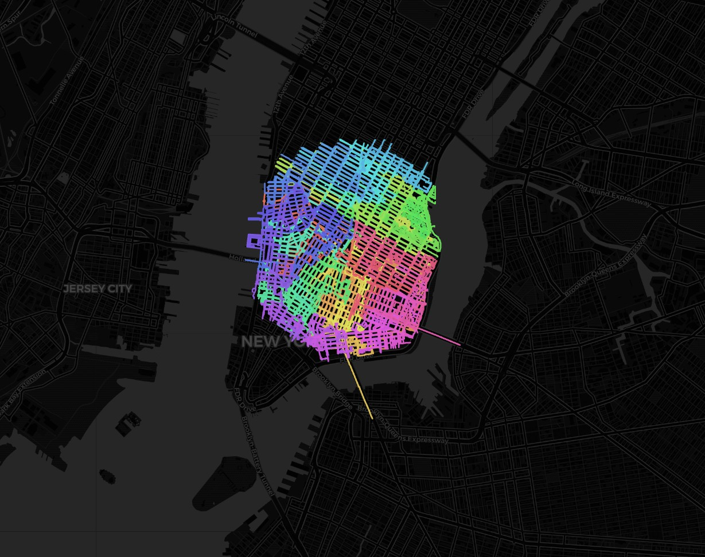

# STR1DE — client-side street coverage planner

Generates running routes that cover every street in an area, each under a
chosen length, minimizing repeats — **entirely in the browser**. No backend.



*A real plan: Cooper Square, Manhattan — 1.2 mi radius, 5 mi max run. **102 runs,
502.2 miles run to cover 440.2 street miles** (+14.1% repeat overhead), solved in
about 2 s in the browser. Each color is one run.*

## Export to your watch

Every run downloads as GPX, and "Download all GPX" grabs the set. This is
actual output from the plan above — run 1, 4.97 mi, 350 track points:

```xml
<?xml version="1.0" encoding="UTF-8"?>
<gpx version="1.1" creator="STR1DE" xmlns="http://www.topografix.com/GPX/1/1">
  <trk><name>STR1DE Run 1</name><trkseg>
      <trkpt lat="40.7279594" lon="-73.9913474"></trkpt>
      <trkpt lat="40.728498" lon="-73.991198"></trkpt>
      <trkpt lat="40.7286131" lon="-73.9912244"></trkpt>
      <!-- … 347 more … -->
  </trkseg></trk>
</gpx>
```

Tick **Include elevation** and each `<trkpt>` also carries `<ele>`. Drop the
file on a Garmin/Coros/Suunto watch, or import it into Strava.

## Run it

It's static files. Serve the folder (a server is needed because the app uses
a Web Worker and fetch):

```bash
python3 -m http.server 8000
```

Then open http://localhost:8000, type an address, pick max run length + radius,
and hit **Plan my runs**. **Demo mode** runs a precomputed sample with no
network at all.

**Route quality** trades solve time for shorter routes. On the plan above:
Fast (the default) solves in ~1.5 s at 14.8% repeat overhead; Best takes ~2.3 s
and gets to 14.1% — about 3 fewer miles to run. Fast captures most of the win
because matching quality saturates almost immediately in the candidate count.

## How it works (all client-side)

1. **Geocode** address → lat/lon via Nominatim (once, on submit).
2. **Fetch streets** within radius via the Overpass API (raw OSM ways/nodes).
3. **Build graph** + **solve** inside a **Web Worker** (`worker.js`) so the UI never freezes.
   Before solving, mid-block **degree-2 shape points are contracted** into
   super-edges (typically ~10x fewer nodes on real OSM data), so the per-odd-node
   Dijkstras in matching run on intersections only; GPX still traces full geometry.
4. **Render** runs on Leaflet; **export** GPX per run.

## Public OSM infrastructure

STR1DE runs on **volunteer-funded services** — Nominatim for geocoding,
Overpass for street data, CARTO for basemap tiles, Open-Elevation for climb.
Nobody is paid to serve your queries. The operators publish usage policies, and
this app is built to stay inside them:

| Their rule | What STR1DE does |
|---|---|
| Nominatim: *"an absolute maximum of 1 request per second"* | One geocode per explicit submit, then cached |
| Nominatim: *"Auto-complete search … you must not implement such a service on the client side"* | No keystroke handler on the address field — geocoding only fires on submit |
| Nominatim: *"Results must be cached on your side"* | Geocode results cached in `localStorage` |
| Nominatim / OSM: *"Clearly display attribution as suitable for your medium"* | Credit in the sidebar and on the map |
| Overpass: *"a maximum of about 10000 requests per day … below about 1 GB per day"* | Responses cached for 7 days; a 60 s cooldown between network fetches |

**Caching.** A query at the default settings (1.2 mi, walk) returns about
**7 MB** of JSON — roughly 42,000 elements. That does not fit in `localStorage`
(~5 MB per origin, stored as UTF-16), so responses are reduced to the fields the
graph builder actually reads (node coordinates and way node-refs — tags are
filtered server-side anyway) and delta-coded as integers at OSM's native 1e7
precision. That same area becomes **0.94 MB, a 7.5x reduction, losslessly**:
rebuilding the graph from cache yields an identical node count, edge count, and
total length. In practice about two dense-city areas fit at once (two cached
Manhattan areas measured 3.8 MB of quota), so entries are evicted
least-recently-used when the quota is hit, and an area too large to cache is
simply not cached rather than breaking the plan.

**Rate limiting.** After a network fetch, the plan button is disabled for 60 s
with a countdown. The timestamp lives in `localStorage`, so reloading the page
does not reset it. Replanning an area that is already cached is exempt — it
costs no request, so it stays instant.

**Asking for less.** The query uses `out skel`, not `out body`. The graph
builder reads only `id`/`lat`/`lon`/`nodes`, and highway filtering already
happened server-side, so every tag byte was being downloaded and thrown away:
7.3 MB → 4.1 MB raw on the default area (0.81 → 0.57 MB gzipped, responses are
already gzip-encoded) and half the JSON to parse, for a byte-identical plan.
`qt` ordering is deliberately *not* used — it reorders elements, which changes
the Euler circuit's start and the run boundaries for no measurable gain.

**When a server says no.** Public Overpass instances refuse work under load, and
the same query can take 2.5 s or 18 s minutes apart. STR1DE tries a mirror
*sequentially* after a failure — never racing them, which would double the load
on volunteer infrastructure to save one user a few seconds. A `200` is not
trusted on its own either: some instances serve a regional extract and answer
out-of-area queries with an empty result in under a second, so an empty response
falls through to the next endpoint rather than surfacing as "no streets here".

Measured across four public instances (3 rounds, same query, interleaved):
`overpass-api.de` 3/3 at 8.0 s median, `kumi.systems` 2/3 at 25.5 s,
`private.coffee` 2/3 at 8.6 s, and `overpass.osm.ch` 3/3 but **0 elements every
time** — it is Switzerland-only. No mirror is reliably better than the main
instance, which is why the fix here is graceful failure rather than a different
default. For real traffic, run your own.

**Identification.** A browser *cannot* set `User-Agent` — it is a forbidden
header name, and a custom header would trigger a CORS preflight, doubling the
request count. Nominatim's policy accepts the alternative: *"Provide a valid
HTTP Referer **or** User-Agent identifying the application."* The browser sends
`Referer` automatically, which is what identifies this app.

**If you fork this and expect real traffic, run your own Overpass instance and
use a paid geocoder.** The public endpoints are a courtesy, not a backend.

## Files

- `coverage_core.js` — the solver (graph, degree-2 contraction, augmentation, Euler circuit, clustering, GPX). Runs in browser + Node.
- `net_cache.js` — response cache, slim/delta encoding, and cooldown arithmetic.
- `worker.js` — Web Worker: Overpass JSON → graph → plan.
- `index.html` — UI.
- `demo.json` — offline sample.
- `test_core.js`, `test_overpass.js`, `test_worker_sim.js`, `test_net_cache.js` —
  assertion-based Node tests (exit non-zero on failure). Run all: `node test_all.js`.
- `attribution.js`, `measure_partition.js` — diagnostics behind the overhead
  and zoning decisions (not part of the app).

## Development

Tests run on `bun` (or `node`): `bun test_all.js`. A pre-commit hook lints
(whitespace + JS syntax) and runs the suite. Enable it once per clone:

```bash
git config core.hooksPath .githooks
```

## Verified

- Coverage is **complete** — every street appears in the plan (tested; an
  early version dropped streets at zone boundaries — fixed by assigning every
  edge to exactly one zone and solving all components within it).
- Every run respects the max-length cap — with one unavoidable exception: a
  single street segment longer than the cap becomes its own (over-cap) run,
  since edges are atomic and can't be split mid-street. Pinned by a test.
- Start anchoring: the first run begins at the intersection nearest the address.
- Matches the Python reference on clean grids (11 runs / +5% identical).
- The cache round-trip is lossless on real OSM data — same nodes, same edges,
  same total length to the last digit.

## Honest limits

- **Heuristic, not optimal — and the gap is now measured, not assumed.**
  Odd-node matching is sorted-greedy over each node's k nearest candidates plus
  a 2-opt pass (k=2 on Fast, k=12 on Best), not optimal Blossom. Compared against
  **exact** optimal matchings computed by subset DP on sampled real sub-instances,
  it lands within **0.3% of optimal at n=8, rising to 1.9% at n=20**. The gap
  grows with instance size, so on a real ~5,000-node odd set it is larger — but
  extrapolating 2.5 orders of magnitude from four points is not a claim this
  repo will make.
- **Blossom is not worth building here.** A rigorous nearest-neighbour lower
  bound (½·Σ distance-to-nearest-odd-peer) puts the shipped matching 1.93x above
  it, which looks like enormous headroom. Calibration says otherwise: on the same
  geometry the true optimum sits ~1.70x above that bound, so most of the apparent
  gap is slack in the bound rather than reachable improvement.
- **An earlier README claim here was half right.** It said better matching would
  recover only ~1% of route length, citing `attribution.js`. As a verdict on the
  matcher shipped at the time that was wrong — replacing arbitrary-order greedy
  with sorted-greedy + 2-opt cut route length 3.6–9.0% on nine real extracts. But
  as a statement about the remaining gap from *today's* matcher to optimal, ~1–2%
  is the right order of magnitude. `attribution.js` has not been re-run and its
  own figure is stale.
- **Real-city overhead is ~14–27% on irregular areas**: covering every street
  honestly requires some deadhead between odd junctions. "Miles run" will exceed
  "street miles" by this much — expected, not a bug. Sparse networks are worse
  (Brattleboro VT measures 45%) because dead-end streets must be run twice.
  (Optional `cluster:true` zoning adds ~5–7% on top for grouped runs; it was
  the default until measurement showed it costs overhead for no compactness
  gain — see `attribution.js`.)
- **Big radii mean big payloads.** The plan above is ~7 MB of OSM JSON and about
  1.2 s of solve time in the worker; the download dominates, not the solve. (It
  used to be 113 s of solve — `augment()` ran a full-graph Dijkstra per matched
  pair when the answer was ~17 nodes away. Fixed; see the commit history.)
- **Elevation is off by default and best-effort.** It POSTs every node to the
  public Open-Elevation API in batches — slow on big areas, and the public
  instance is rate-limited and sometimes down. On any failure the plan still
  completes with climb shown as "–" (null, never a fabricated 0). The worker
  accepts an `elevationUrl` override for a self-hosted endpoint.
- **The cooldown is per-browser, not global.** It stops one tab from hammering
  Overpass; it cannot stop a hundred forks from doing so.
